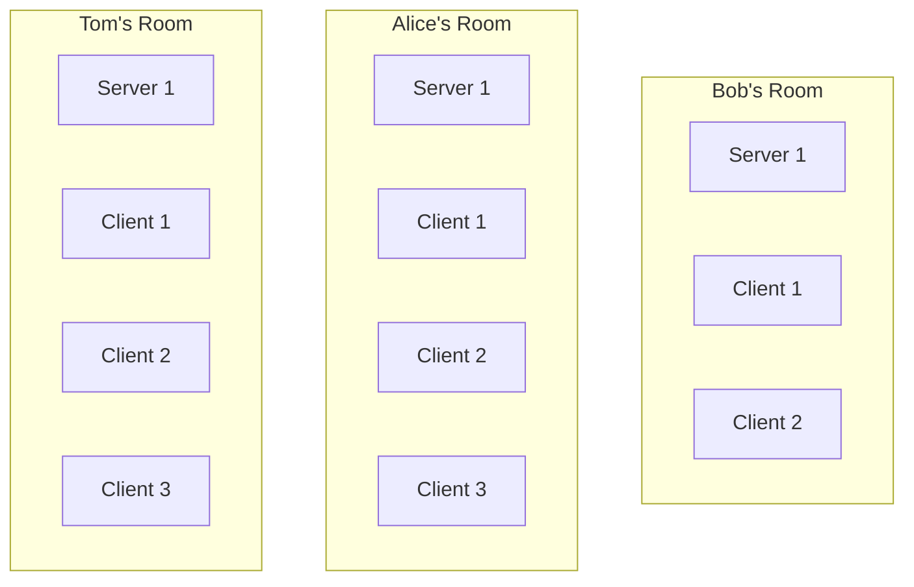
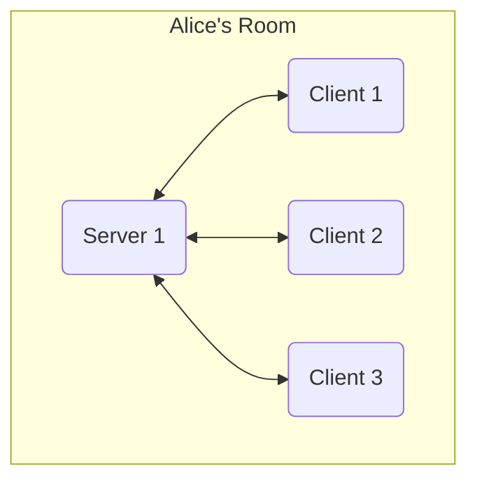
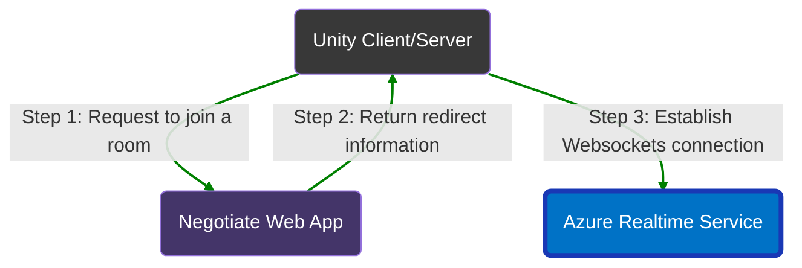
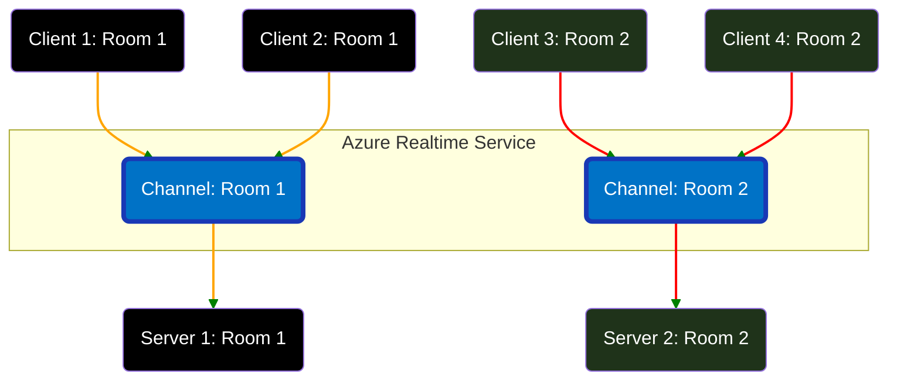
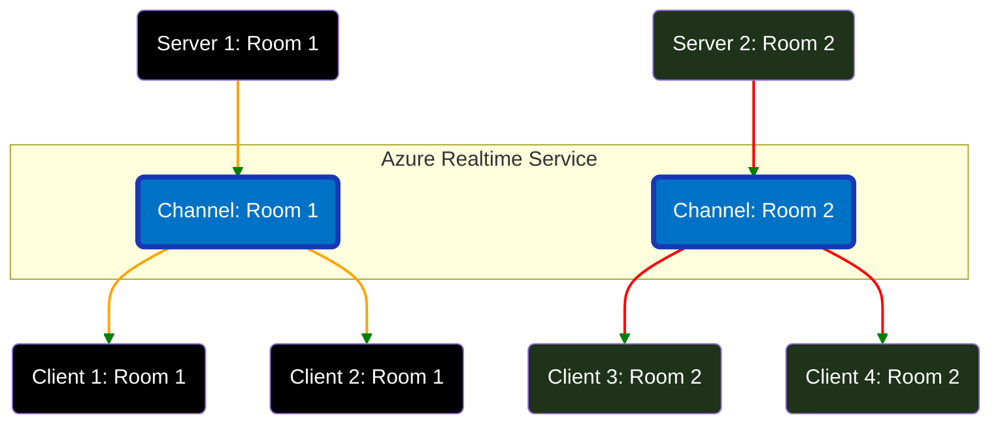

# Azure Realtime Transport for Netcode for Gameobjects

Azure realtime transport is designed to use Azure's managed realtime services to transfer data between server and clients.

Azure's managed realtime services support `Websocket`, so if you are seeking solution for `Websocket` or extend your game to support `WebGL` platform, this transport is just for you.

This transport hides most of the technical details, all you need to do is to create one of the Azure realtime services, and connect your service with a connection string.

What's more, with managed Azure realtime services, you can have scalability, high availability, live monitoring, private link, auto-reconnect functionality and more.

There're 2 realtime services you can choose from:

* [Azure Web PubSub service](https://azure.microsoft.com/products/web-pubsub)
* [Azure SignalR service](https://azure.microsoft.com/products/signalr-service/)

## Setup Azure Realtime Services

Azure provides free resource quota to create realtime services. Feel free to create one.

### Create Azure Web PubSub Service

  [Quickstart: Create a Web PubSub instance from Azure portal](https://learn.microsoft.com/azure/azure-web-pubsub/howto-develop-create-instance)
  [Quickstart: Create a Web PubSub instance with Azure CLI](https://learn.microsoft.com/azure/azure-web-pubsub/quickstart-cli-create)

### Create Azure SignalR Service

[Create an Azure SignalR resource](https://learn.microsoft.com/en-us/azure/azure-signalr/signalr-quickstart-dotnet-core#create-an-azure-signalr-resource)

> Not supported in this transport for now. Please create a github issue or create a ticket in azure portal if you want us to support it soon.

## Setup Unity

### Install Packages

Required:

1. [Install Netcode for Gameobjects](https://docs-multiplayer.unity3d.com/netcode/current/installation/install).
2. [Install Azure Realtime Transport for Netcode for Gameobjects](../README.md): Install this package via the package manager by clicking the '+' (plus) button located in the upper left of the window and selecting `Add package from git URL...` when prompted provide the following URL:  
`https://github.com/Unity-Technologies/multiplayer-community-contributions.git?path=/Transports/com.community.netcode.transport.azure-realtime`

Optional:

1. [Install ParrelSync](https://github.com/VeriorPies/ParrelSync#installation): ParrelSync is a Unity editor extension that allows users to test multiplayer gameplay without building the project by having another Unity editor window opened and mirror the changes from the original project.

### Setup Dev Negotiate server

1. Copy connection string in `Keys` page of your realtime service you just created.
2. Install [dotnet runtime](https://learn.microsoft.com/dotnet/core/install/) if you don't have one.
3. In `Proejct` view, right click `Packages/Azure Realtime Transport for Netcode for Gameobjects`, and click `Show in Explorer`.
4. Go to `NegotateServers/` folder, in `appsettings.json`, fill the connection string in `ConnectionString` section.  
5. In terminal app, run `dotnet run` to start negotiation server.
6. Get listening URL in console log. For example: `Now listening on: https://localhost:7172`

### Setup Transport

1. Add `AzureRealtimeTransport` component to your GameObject containing your NetworkManager.
2. Set the `Network Transport` field on the NetworkManager to the `AzureRealtimeTransport`.
3. Enter a room name into the `Room Name` field of the `AzureRealtimeTransport`.
4. Enter negotiate endpoint. For example, `https://localhost:7172/negotiate` if you use the builtin developing negotiate server.
5. Use the `StartServer`, `StartHost` and `StartClient` functions as usually to host a game and have clients connect to it.

## Design Model

> So far, the transport should be able to use. The below sections is `optional` to read for using this transport.
> The folliowing contains details about how Unity and Azure realtime service are connected.
> The following is useful to read when you scalability is in your plan.

This transport supports concept `room`, which allows a server and multiple clients to enter.
All clients in the same room will synchronize through a server, so that they can paly together.

Take Alice's room for an example.

Logically, the server and one client's connection is bidirectional communication. In order to do so, Azure realtime service handles:

* Connection Negotiation: Servers and clients enter some room.
* Data Synchronization: Synchronize network data among server and clients.

### Negotiation Flow

> In generaral, negotiate webapp is used to redirect client/server connection to Azure realtime service.
> The negotiate webapp can also be the same web app to your server.
> If you consider scalibility, consider keeping standalone negotiate web apps to handle Websockets connection request.

### Server Negotiation

1. Server requests redirect information from negotiate web app with the room name (_Alice's Room_).
2. Server established Websocket connection Azure realtime service only when negotiate web app ensure there's no server subscribes to the room channel.

### Client Negotiation

1. Client requests redirect information from negotiate web app with the room name ((_Alice's Room_)).
2. Client establishes Websocket connection to Azure realtime service only when negotiate web app ensures there's a server subscribes to the room channel.
3. Notify server via the room channel, that this client is connected.

### Client Data Synchroniazation: RPC in server

### Server Data Synchroniazation: Call RPC in client

